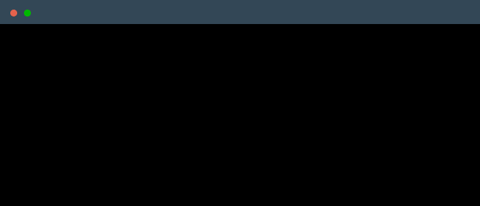

<!-- Header -->

<!--
    Your own Terminal GIF can be created here -> https://www.terminalgif.com
-->

    

### Main skills

### Studying

### Connect with me!

    <a href="https://www.linkedin.com/in/naitik-verma-36601a381">
        
   
<!-- Footer -->

